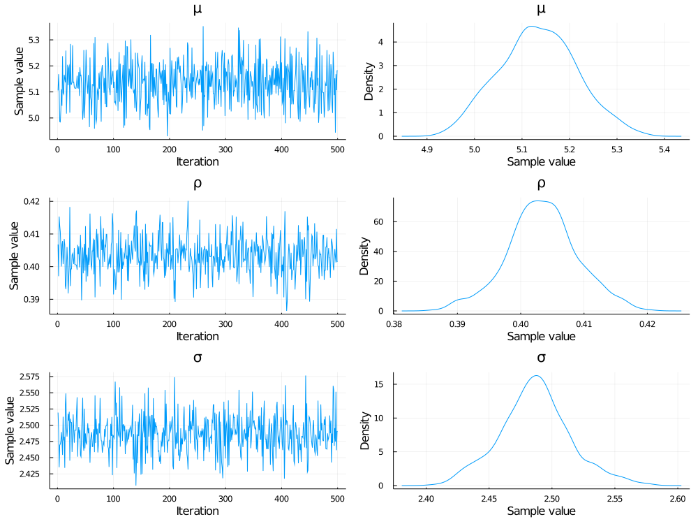

# GaussianMarkovRandomFields.jl
Lightweight sparse GMRF type, compatible with forward and reverse AD

This work-in-progress package provides an implementation of a Gaussian Markov random field--that is, a multivariate Gaussian distribution defined by a sparse precision matrix.  GMRFs are useful for modeling variables with spatial and/or temporal autocorrelation in an efficient way, since they can be defined in terms of a sparse precision matrix, rather than a dense covariance matrix.

The `GMRF` type defined here is a `Distributions.ContinuousMultivariateDistribution`.  It is basically equivalent to an `MvNormalCanon` distribution from Distributions.jl, with the difference that it uses the pure-Julia LDLFactorizations.jl instead of CHOLMOD under the hood, so it works with ForwardDiff and ReverseDiff (though not Zygote at the moment).  It's performance is on par with the As the AD and Distributions ecosystems develop further this package may become irrelevant, but at the moment it's the only out-of-the-box way to include a GMRF in a Turing model (that I know of, anyway).

Issues, bugfixes, and contributions welcome!

## Example: fitting an autoregressive time-series model in Turing

```julia
using GaussianMarkovRandomFields
using Turing
using SparseArrays
using StatsPlots

function ar_precision(ρ, k)
    return spdiagm(-1 => -ρ*ones(k-1), 0 => ones(k), 1 => -ρ*ones(k-1))
end

k = 5_000   # number of measurements in time series
σ = 2.5     # marginal variance
ρ = 0.4     # autocorrelation coefficient
μ = 5.0     # mean

Q = ar_precision(ρ, k) ./ σ^2
d = GMRF(μ*ones(k), Q)
x = rand(d)
plot(x)

@model function AR1(x)
    n = length(x)
    σ ~ Gamma(2, 3)
    ρ ~ Uniform(0, 0.5)
    μ ~ Normal(0, 10)
    Q = ar_precision(ρ, n) ./ σ^2
    x ~ GMRF(μ*ones(k), Q)
end

mod = AR1(x)
@time chn = sample(mod, NUTS(), 1000)
plot(chn)
```


After compiling, this model runs in ~16 seconds (single-threaded) on a laptop with an Intel Core i9-9980 2.4 GHz CPU.
